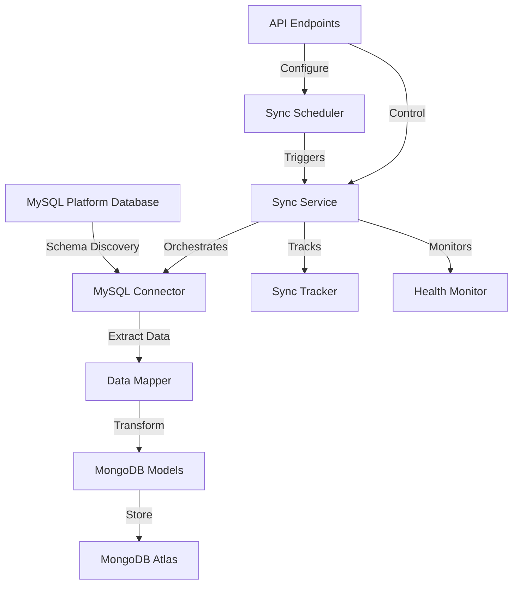

# MySQL-MongoDB Sync System Documentation

## Overview

This document outlines the design and implementation of an automated data synchronization system that connects to a MySQL platform database and syncs data to the local MongoDB database. The system follows clean architecture principles and supports incremental, scheduled synchronization.

## Architecture Overview

### System Components

```
src/sync/
├── __init__.py                    # Module initialization
├── mysql_connector.py             # MySQL connection & schema discovery
├── scheduler.py                   # Dynamic interval background scheduler
├── sync_service.py                # Main sync orchestration service
├── data_mapper.py                 # MySQL → MongoDB data transformation
├── sync_tracker.py                # Last sync timestamp tracking
├── health_monitor.py              # Sync health monitoring & alerts
└── strategies/                    # Entity-specific sync strategies
    ├── __init__.py
    ├── base_strategy.py           # Abstract base sync strategy
    ├── product_strategy.py        # Product sync logic
    ├── order_strategy.py          # Order sync logic
    ├── user_strategy.py           # User/Customer sync logic
    └── inventory_strategy.py      # Inventory sync logic

src/models/
├── mysql_models.py                # MySQL database schema models
└── mongodb_models.py              # Updated MongoDB schema models (real data)

src/config/
└── sync_settings.py               # Sync-specific configuration
```

## Core Features

### 1. Incremental Data Synchronization
- **Timestamp-based sync**: Only fetch records modified since last sync
- **Change detection**: Track `created_at`, `updated_at` fields in MySQL
- **Batch processing**: Handle large datasets efficiently
- **Conflict resolution**: Handle data conflicts between platforms

### 2. Dynamic Schema Discovery
- **Auto-detection**: Automatically discover MySQL table structures
- **Schema mapping**: Dynamic mapping between MySQL and MongoDB schemas
- **Field validation**: Ensure data integrity during transformation
- **Type conversion**: Handle MySQL → MongoDB data type differences

### 3. Configurable Scheduling
- **Dynamic intervals**: Configurable sync frequency (default: 1 hour)
- **Runtime changes**: Update sync interval without restart
- **Pause/Resume**: Control sync operations via API
- **Manual triggers**: Force immediate sync when needed

### 4. Error Handling & Monitoring
- **Connection resilience**: Automatic retry with exponential backoff
- **Data validation**: Comprehensive error checking
- **Health monitoring**: Track sync status and performance
- **Alerting**: Notify on sync failures or data anomalies

## Data Flow Architecture



## Configuration

### Environment Variables

```bash
# MySQL Connection
MYSQL_HOST=your-platform-mysql-host
MYSQL_PORT=3306
MYSQL_USER=your-username
MYSQL_PASSWORD=your-secure-password
MYSQL_DATABASE=platform-database-name
MYSQL_CHARSET=utf8mb4

# MySQL Connection Pool
MYSQL_MIN_POOL_SIZE=1
MYSQL_MAX_POOL_SIZE=10
MYSQL_POOL_TIMEOUT=30
MYSQL_POOL_RECYCLE=3600

# Sync Configuration
SYNC_ENABLED=true
SYNC_INTERVAL_MINUTES=60
SYNC_BATCH_SIZE=1000
SYNC_MAX_RETRIES=3
SYNC_RETRY_DELAY=30

# Sync Tables (comma-separated)
SYNC_TABLES=products,orders,customers,inventory,categories

# MongoDB Sync Collections
SYNC_PRODUCTS_COLLECTION=products
SYNC_ORDERS_COLLECTION=orders
SYNC_CUSTOMERS_COLLECTION=customers
SYNC_INVENTORY_COLLECTION=inventory
```

### Settings Class

```python
# src/config/sync_settings.py
class SyncSettings(BaseSettings):
    # MySQL Database Configuration
    MYSQL_HOST: str
    MYSQL_PORT: int = 3306
    MYSQL_USER: str
    MYSQL_PASSWORD: str
    MYSQL_DATABASE: str
    MYSQL_CHARSET: str = "utf8mb4"
    
    # Connection Pool Settings
    MYSQL_MIN_POOL_SIZE: int = 1
    MYSQL_MAX_POOL_SIZE: int = 10
    MYSQL_POOL_TIMEOUT: int = 30
    MYSQL_POOL_RECYCLE: int = 3600
    
    # Sync Settings
    SYNC_ENABLED: bool = True
    SYNC_INTERVAL_MINUTES: int = 60
    SYNC_BATCH_SIZE: int = 1000
    SYNC_MAX_RETRIES: int = 3
    SYNC_RETRY_DELAY: int = 30
    
    # Table Configuration
    SYNC_TABLES: List[str] = ["products", "orders", "customers", "inventory"]
    
    class Config:
        env_file = ".env"
```

## Implementation Details

### 1. MySQL Connector (`mysql_connector.py`)

**Responsibilities:**
- Establish and manage MySQL connections
- Discover database schema dynamically
- Execute incremental data queries
- Handle connection pooling and error recovery

**Key Methods:**
```python
class MySQLConnector:
    async def connect() -> bool
    async def discover_schema(table_name: str) -> Dict[str, Any]
    async def get_incremental_data(table: str, last_sync: datetime) -> List[Dict]
    async def get_table_count(table: str) -> int
    async def disconnect()
```

### 2. Sync Service (`sync_service.py`)

**Responsibilities:**
- Orchestrate the entire sync process
- Coordinate between different sync strategies
- Handle errors and retry logic
- Track sync progress and metrics

**Key Methods:**
```python
class SyncService:
    async def sync_all_tables() -> SyncResult
    async def sync_table(table_name: str) -> TableSyncResult
    async def get_sync_status() -> SyncStatus
    async def pause_sync() / resume_sync()
```

### 3. Data Mapper (`data_mapper.py`)

**Responsibilities:**
- Transform MySQL data to MongoDB format
- Handle data type conversions
- Apply business logic transformations
- Validate data integrity

**Key Methods:**
```python
class DataMapper:
    def map_product(mysql_row: Dict) -> Product
    def map_order(mysql_row: Dict) -> Order
    def map_customer(mysql_row: Dict) -> Customer
    def map_inventory(mysql_row: Dict) -> Inventory
```

### 4. Dynamic Scheduler (`scheduler.py`)

**Responsibilities:**
- Schedule sync operations at configurable intervals
- Support runtime interval changes
- Handle sync job queuing and execution
- Provide sync control API

**Key Methods:**
```python
class SyncScheduler:
    def start_scheduler()
    def stop_scheduler()
    def update_interval(minutes: int)
    def trigger_immediate_sync()
    def get_next_sync_time() -> datetime
```

### 5. Sync Strategies (`strategies/`)

Each strategy handles entity-specific sync logic:

**Base Strategy Interface:**
```python
class BaseSyncStrategy(ABC):
    @abstractmethod
    async def sync(self, last_sync_time: datetime) -> StrategyResult
    
    @abstractmethod
    def validate_data(self, data: Dict) -> bool
    
    @abstractmethod
    async def transform_data(self, mysql_data: List[Dict]) -> List[Dict]
```

## Sync Process Flow

### 1. Initialization Phase
```
1. Load sync configuration
2. Initialize MySQL connector
3. Discover database schema
4. Validate MongoDB collections
5. Load last sync timestamps
6. Start health monitoring
```

### 2. Sync Execution Phase
```
1. For each configured table:
   a. Get last sync timestamp
   b. Query MySQL for incremental data
   c. Transform data using appropriate mapper
   d. Validate transformed data
   e. Upsert to MongoDB
   f. Update sync timestamp
   g. Log sync metrics
```

### 3. Error Handling
```
1. Connection errors → Retry with exponential backoff
2. Data validation errors → Log and skip record
3. Transform errors → Log and continue with next record
4. MongoDB errors → Retry operation
5. Critical errors → Pause sync and alert
```

## API Endpoints

### Sync Control Endpoints

```python
# GET /sync/status
{
    "sync_enabled": true,
    "last_sync": "2025-01-10T14:30:00Z",
    "next_sync": "2025-01-10T15:30:00Z",
    "sync_interval_minutes": 60,
    "tables_synced": ["products", "orders", "customers"],
    "sync_metrics": {
        "total_records": 15420,
        "last_sync_duration": "00:02:15",
        "success_rate": 99.8
    }
}

# POST /sync/trigger - Manual sync trigger
# POST /sync/pause - Pause sync operations
# POST /sync/resume - Resume sync operations
# PUT /sync/interval - Update sync interval

# GET /sync/health
{
    "mysql_connection": "healthy",
    "mongodb_connection": "healthy",
    "last_sync_status": "success",
    "pending_operations": 0,
    "error_count": 2
}
```

## Monitoring & Logging

### Log Structure
```python
{
    "timestamp": "2025-01-10T14:30:00Z",
    "level": "INFO",
    "component": "sync_service",
    "table": "products", 
    "operation": "sync_completed",
    "records_processed": 150,
    "records_updated": 25,
    "records_created": 125,
    "duration_seconds": 12.5,
    "errors": 0
}
```

### Key Metrics
- **Sync Success Rate**: Percentage of successful sync operations
- **Data Transfer Rate**: Records processed per minute
- **Error Rate**: Failed operations per sync cycle
- **Latency**: Time between MySQL update and MongoDB sync
- **Data Integrity**: Validation failure rate

## Error Scenarios & Solutions

### 1. MySQL Connection Issues
- **Problem**: Network timeout, credential changes
- **Solution**: Connection retry with exponential backoff, credential validation

### 2. Schema Changes
- **Problem**: New columns, table structure changes
- **Solution**: Dynamic schema discovery, field mapping validation

### 3. Data Conflicts
- **Problem**: Same record modified in both systems
- **Solution**: Last-write-wins strategy with conflict logging

### 4. Large Dataset Sync
- **Problem**: Memory issues, timeout on initial sync
- **Solution**: Batch processing, pagination, progress tracking

### 5. MongoDB Write Failures
- **Problem**: Connection issues, storage limits
- **Solution**: Retry mechanism, connection pooling, disk monitoring

## Security Considerations

### 1. Credential Management
- Use environment variables for sensitive data
- Support encrypted credential storage
- Implement credential rotation

### 2. Network Security
- Support SSL/TLS for MySQL connections
- Implement connection encryption
- Use VPN/private networks when possible

### 3. Data Privacy
- Implement field-level encryption for sensitive data
- Support data masking/anonymization
- Audit trail for data access

## Performance Optimization

### 1. Database Optimization
- Use appropriate indexes on timestamp columns
- Implement connection pooling
- Optimize query patterns for incremental sync

### 2. Memory Management
- Stream large result sets
- Implement batch processing
- Use generators for data transformation

### 3. Network Efficiency
- Compress data transfer
- Use persistent connections
- Implement smart retry policies

## Testing Strategy

### 1. Unit Tests
- Test individual sync strategies
- Validate data transformation logic
- Mock external dependencies

### 2. Integration Tests
- Test MySQL-MongoDB data flow
- Validate schema discovery
- Test error scenarios

### 3. Performance Tests
- Load testing with large datasets
- Stress testing sync intervals
- Memory usage profiling

## Deployment Considerations

### 1. Environment Setup
- Separate configurations for dev/staging/prod
- Database connection validation
- Resource allocation planning

### 2. Monitoring Setup
- Log aggregation and analysis
- Performance metrics collection
- Alert configuration

### 3. Maintenance
- Regular health checks
- Schema drift detection
- Performance optimization

## Future Enhancements

### 1. Real-time Sync
- Implement CDC (Change Data Capture)
- Support real-time streaming
- Event-driven architecture

### 2. Multi-directional Sync
- Support MongoDB → MySQL sync
- Conflict resolution strategies
- Data consistency guarantees

### 3. Advanced Features
- Custom transformation rules
- Data validation rules
- Sync workflow automation

---

*This documentation serves as the foundation for implementing the MySQL-MongoDB synchronization system following clean architecture principles.*